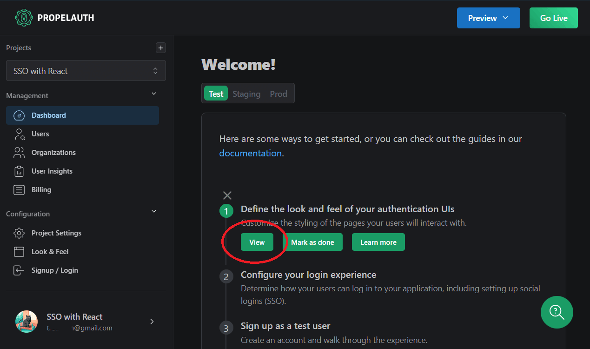
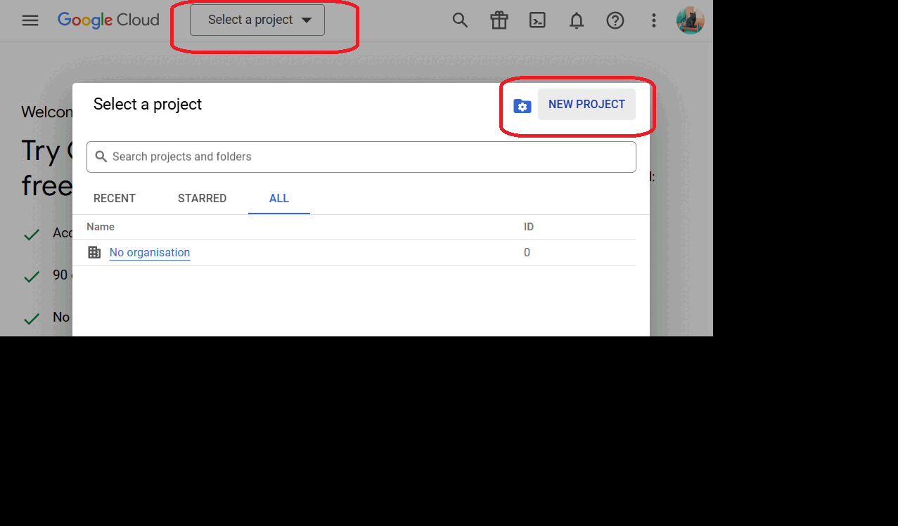

# Quick Start

To clone and start this project, execute the following commands:

```bash
git clone https://github.com/samueltrevor/propelauth-react-basic-example.git
cd propelauth-react-basic-example
npm install
npm start
```
---
# The Easiest Way to Set Up SSO in React: Complete Guide in 5 Minutes

Setting up Single Sign-On (SSO) in React can be a daunting task. You want users to sign in using Google, Microsoft, GitHub, Apple, Slack, and more. You'll need a login page, signup page, and password reset functionality.

Traditionally, this involves writing all the authentication logic, views, and components, and integrating with Identity Providers' (IDP) APIs manually. So to make things simple and easy, we would use Propelauth, which handles all the heavy lifting and also saves us a lot of maintenance in the future.

## Step 1. Setting up Propelauth

1. **Create an Account**: Log in to Propelauth, enter an organization name and project name.
2. **Create a Login/Signup Page**: On the welcome page, select "Define the look and feel of your authentication UIs." Add your logo, background image, and color scheme, then click "Finish Setup."



## Step 2. Setting Up Google

We're going to use Google for this example. You can find guides for other IDPs like [Microsoft](https://docs.propelauth.com/sso-and-integrations/social-login/microsoft), [GitHub](https://docs.propelauth.com/sso-and-integrations/social-login/github), [Apple](https://docs.propelauth.com/sso-and-integrations/social-login/apple), [Slack](https://docs.propelauth.com/sso-and-integrations/social-login/slack), [LinkedIn](https://docs.propelauth.com/sso-and-integrations/social-login/linkedin), [Salesforce](https://docs.propelauth.com/sso-and-integrations/social-login/salesforce), and more in the [Propelauth documentation](https://docs.propelauth.com/sso-and-integrations).

First, Go to [Google Cloud Platform Console](https://console.cloud.google.com/).
1. **Create Project**: Click **Create Project**, enter a project name, and click Create.
2. **Create OAuth Consent Screen**:
   - Navigate to **APIs & Services > OAuth consent screen**,
   - Select **External** and click **Create**.
   - Follow the next four steps, add test users, and click **Save and Continue**.
3. **Create OAuth 2.0 Client ID and Secret**:
    - Go to **APIs & Services > Credentials**.
    - Click **Create Credentials** and select **OAuth client ID**.
    - Choose **Web application**.
    - Enter your app name (e.g., My Todo App).
    - Add the authorized redirect URIs from [Propelauth](https://app.propelauth.com/) **Configuration > Signup / Login >> Google**.
    - Click **Create** and copy the client ID and secret to the Propelauth dashboard.



SSO set. Now log in to your account. Go back to Propelauth, click on the Preview button at the top, and log in.

## Step 3. Integration with React

### Install Propelauth

```bash
npm install @propelauth/react
```
Go to **Propelauth Integrate your project > Frontend Integration**, enter your development URL, and click **Save**.

### Set Up Environment Variables

Create a `.env.local` file in your project root and add the following:
```bash
VITE_AUTH_URL=https://your-auth-url.propelauthtest.com
``` 


> Note: In production mode, you can use your own domain.

### Wrap Your App with AuthProvider
  
```jsx
import { AuthProvider } from '@propelauth/react';
// ...
<AuthProvider authUrl={import.meta.env.VITE_AUTH_URL}>
  <App />
</AuthProvider>
```

### Add Authentication Components:

```jsx
// App.js
import './App.css'
import { useAuthInfo, useLogoutFunction } from '@propelauth/react'

function App() {
  const authInfo = useAuthInfo()
  const logout = useLogoutFunction()

  if (authInfo.loading) {
    return <h2>Loading...</h2>
  }

  if (!authInfo.isLoggedIn) {
    return <a href={import.meta.env.VITE_AUTH_URL}>Login</a>
  }

  return (
    <>
      <h1>Propelauth + React</h1>
      <div>
        
      </div>
      <h2>
        Welcome, {authInfo.user.firstName}!
      </h2>
      <p>
        You are logged in as <a href={`mailto:${authInfo.user.email}`}>{authInfo.user.email}</a>
      </p>
      <div className="card">
        <button onClick={() => logout()}>
          Log Out
        </button>
      </div>
    </>
  )
}

export default App
```

Congratulations! You have successfully integrated Propelauth with your React app.


## Next Steps:
  - [Integrate with Backend](https://docs.propelauth.com/reference#backendLibraries)
  - [Production Deployment](https://docs.propelauth.com/getting-started/deploy-to-prod)
